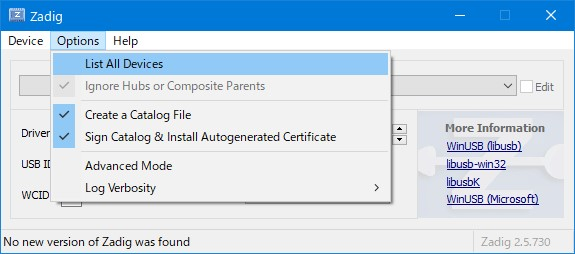

# BveNumerousControllerInterface

BVE5、6 用のコントローラー入力プラグイン

BVE で様々なコントローラーを使えるようにするプラグインです。

Supported language is only Japanese now.

コントローラーごとに入力プラグインが不要になり、このプラグインだけであらゆるコントローラーが使えるようにするのが目標です。

コントローラーはマスコンタイプやボタンを押してノッチを操作するなどの様々な操作方法に対応します。

> [!WARNING]
> BveEX との連携機能はまだまだ不安定であり、手動でのインストールが必要です。[こちら](https://github.com/kusaanko/BveNCIBveExPlugin)をご覧ください。

# 対応コントローラー

| コントローラー                                         | テスト済み | ドライバー必須 | 状態                     |
| :----------------------------------------------------- | :--------- | :------------- | :----------------------- |
| TCPP-20001 電車で GO!コントローラー ワンハンドルタイプ | はい       | いいえ         | 力行 1 と 4 の判定が曖昧 |
| SLPH-00051 電車で GO!コントローラー ツーハンドルタイプ | はい       | いいえ         | 力行 1 と 4 の判定が曖昧 |
| TCPP-20001 電車で GO!コントローラー TYPE2              | はい       | はい           | 100%                     |
| TCPP-20011 電車で GO!新幹線 専用コントローラ           | はい       | はい           | 100%                     |
| マルチトレインコントローラー P4B6                      | はい       | はい           | 100%                     |
| マルチトレインコントローラー P4B7                      | はい       | はい           | 100%                     |
| マルチトレインコントローラー P5B5                      | はい       | はい           | 100%                     |
| マルチトレインコントローラー P5B7                      | はい       | はい           | 100%                     |
| マルチトレインコントローラー P5B8                      | いいえ     | はい           | 動作しないデバイスあり   |
| マルチトレインコントローラー P13B7                     | はい       | はい           | 100%                     |
| シリアル通信コントローラー                             | はい       | いいえ         | 100%                     |
| Xbox 用のコントローラー                                | はい       | いいえ         | 100%                     |
| その他 DirectInput に対応したコントローラー            | はい       | いいえ         | 100%                     |

一覧に書かれているコントローラーの一部はデフォルトでプロファイルのみを用意しているコントローラーです。その他のコントローラー（瑞起 電車でＧＯ！！専用ワンハンドルコントローラー for Nintendo Switch など）も PC に繋いでプロファイルを自作していただくことで使えるものもあります。

また、マスコンだけでなく ATS 操作用のコントローラーも使用できます。

対応コントローラーの追加要望にも対応します。[Issues](https://github.com/kusaanko/BveNumerousControllerInterface/issues)ページで報告していただけるとありがたいです。[Twitter](https://twitter.com/kusaanko)での報告でも可能です。

> [!IMPORTANT]
> ドライバーが必要と書かれたコントローラーは下のドライバーをインストールする項目を参照してください。
>
> ドライバーをインストールしなかった場合、設定画面でコントローラーが表示されません。

> [!IMPORTANT]
> 必ず使用するコントローラーには設定画面で「有効にする」にチェックを入れてください。

※「電車で GO！」は、日本およびその他の国における株式会社 タイトーの商標または登録商標です。

※その他記載されている商品名は各社の商標または登録商標です。

# 機能

- 電車で GO!コントローラー等のマスコンを BVE で使用可能にする
- BVE 起動中にコントローラが切断後、再接続された場合自動復帰します
- 各ボタンに機能が割り当てられます
- 複数のコントローラーが接続中でも動作します(ただし、同じ名前のコントローラーが複数接続中だとうまくコントローラーを選択できません)
- ATC 操作専用コントローラーが使えます
- プラグインで独自の通信規格のコントローラーを追加可能

# インストール

[Releases](https://github.com/kusaanko/BveNumerousControllerInterface/releases)ページから最新版をダウンロードします。

`Installer.zip`をダウンロードして下さい。もしインストーラーがうまくいかない場合は`NumerousControllerInterface.zip`をダウンロードし、`BveTs.exe`のあるフォルダ上に展開してください。

</img>

</img>

このような警告が出てきた際は`不審なファイルをダウンロード`を押してください。署名などをしていないため出る警告です。

## インストーラーによる自動インストール

NumerousControllerInterfaceInstaller.exe をダブルクリックします。セキュリティについて聞かれるので詳細情報を押して、実行してください。

</img>

</img>

BVE を起動し、設定画面を開き、入力デバイスを開きます。

`NumerousControllerInterface`にチェックを入れ、その他の不要な入力プラグインを無効化します。

## 手動でインストール

BVE5.8 以前なら`C:\Program Files (x86)\mackoy\BveTs5`、BVE6 以降なら`C:\Program Files\mackoy\BveTs6`を開き(もしくは BVE をインストールしたディレクトリ)、ダウンロードした zip ファイルを展開し、中身を配置します。

配置した dll ファイルを右クリックしてプロパティを開きます。(LibUsbDotNet.dll、Input Devices\Kusaanko.NumerousControllerInterface.dll)  
セキュリティを許可して下さい。

  
BVE を起動し、設定画面を開き、入力デバイスを開きます。

NumerousControllerInterface にチェックを入れ、その他の不要な入力プラグインを無効化します。

# ドライバーをインストールする

USB 接続でコントローラーとして認識されないデバイスにはドライバーを当てる必要があります。[Zadig](https://zadig.akeo.ie/)を使用してドライバーを当ててください。ドライバーには WinUSB を使用してください。

一覧にコントローラーがないという場合は Options の List All Devices にチェックを入れてみてください。

## デバイス名を変える

初期状態の`Unknown Device`だとデバイスマネージャーで見にくいという方は、デバイス名の横の Edit というチェックボックスにチェックを入れるとデバイス名が編集できるようになるので、お好きな名前を入力してからドライバーをインストールしてください。

# コントローラーを有効にする

このプラグインではあらゆるコントローラーを同時に検出するため、コントローラーを有効にするという設定が必要です。

Bve の設定画面を開き、入力デバイスを開きます。

NumerousControllerInterface を選択してプロパティーをクリックして下さい。

コントローラーから使いたいコントローラーを選択して、出てきた画面の指示に従って下さい 。

コントローラーを使用するには、コントローラー v を有効にするにチェックを入れる必要があります。

# BveEX との連携機能

[こちら](https://github.com/kusaanko/BveNCIBveExPlugin)

# プラグインについて(試験的機能)

プラグイン機能を用意していますが、これは NumerousControllerInterface に統合するほどの機能でないコントローラー、完全プライベート用のコントローラーにのみ使用してください。よって、プラグインに対しては高機能な機能を提供していません。（プライベート用に対しては十分な機能ですが）このプラグインはこのプラグインのみを導入することでたくさんのコントローラーに対応できることを目的にしています。可能な限りプルリクエストお願いします！！

作成法に関しては[こちら](https://github.com/kusaanko/BveNumerousControllerInterface/blob/main/CONTRIBUTING.md)を御覧ください。

# コントリビュート、内部 API の利用方法について

[こちら](https://github.com/kusaanko/BveNumerousControllerInterface/blob/main/CONTRIBUTING.md)を御覧ください。

# 協力

サハ 209 - [@saha209](https://github.com/saha209)
そうぽん - [Twitter](https://twitter.com/So8701_10)

# ライセンス

[SlimDX](https://github.com/SlimDX/slimdx) - Copyright (c) 2007-2012 SlimDX Group [MIT License](https://github.com/SlimDX/slimdx/blob/master/License.txt)

[MIT License](https://github.com/JamesNK/Newtonsoft.Json/blob/master/LICENSE.md)

[LibUsbDotNet](https://github.com/LibUsbDotNet/LibUsbDotNet) - [GNU Lesser General Public License v3.0](https://github.com/LibUsbDotNet/LibUsbDotNet/blob/master/LICENSE)
