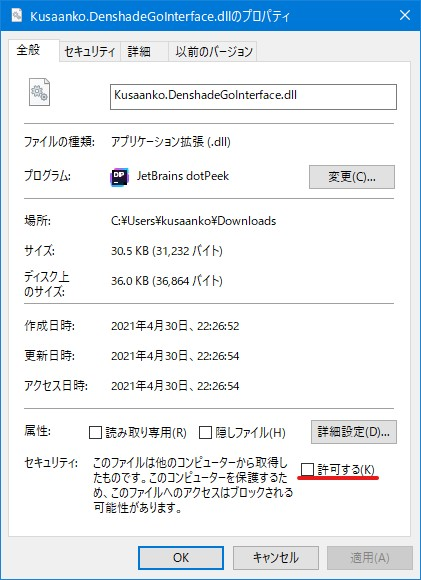

# BveNumerousControllerInterface
Bve5、6用のコントローラー入力プラグイン  
コントローラーごとに入力プラグインが不要になり、このプラグインだけであらゆるコントローラーが使えるようにするのが目標です。  
このプラグインは次のコントローラーに対応しています

* TCPP-20001 電車でGO!コントローラー ワンハンドタイプ
* SLPH-00051 電車でGO!コントローラー ツーハンドタイプ
* TCPP-20001 電車でGO!コントローラー TYPE2
* マルチトレインコントローラー P4B6/P4B7/P5B5/P5B8
* Xbox用のコントローラー
* その他DirectInputに対応したコントローラー

また、マスコンだけでなくATS操作用のコントローラーも使用できます。

対応コントローラーの追加要望にも対応します。[Issues](https://github.com/kusaanko/BveNumerousControllerInterface/issues)ページで報告していただけるとありがたいです。[Twitter](https://twitter.com/kusaanko)での報告でも可能です。

※「電車で GO！」は、日本およびその他の国における株式会社 タイトーの商標または登録商標です。

※その他記載されている商品名は各社の商標または登録商標です。
# 機能
* 電車でGO!コントローラー等のマスコンをBveで使用可能にする
* Bve起動中にコントローラが切断後、再接続された場合自動復帰します
* 各ボタンに機能が割り当てられます
* 複数のコントローラーが接続中でも動作します(ただし、同じ名前のコントローラーが複数接続中だとうまくコントローラーを選択できません)
* ATC操作専用コントローラーが使えます

# インストール
[Releases](https://github.com/kusaanko/BveNumerousControllerInterface/releases)ページから最新版をダウンロードします。

Bve5.8以前なら`NumerousControllerInterface_Bve5.zip`、Bve6.0以降なら`NumerousControllerInterface_Bve6.zip`をダウンロードして下さい。

Bve5.8以前なら`C:\Program Files (x86)\mackoy\BveTs5`、Bve6.0以降なら`C:\Program Files\mackoy\BveTs6`を開き(もしくはBveをインストールしたディレクトリ)、ダウンロードしたzipファイルを展開し、中身を配置します。

配置したdllファイルを右クリックしてプロパティを開きます。(Newtonsoft.Json.dll、LibUsbDotNet.dll、Input Devices\Kusaanko.NumerousControllerInterface.dll)  
セキュリティを許可して下さい。

  
Bveを起動し、設定画面を開き、入力デバイスを開きます。

NumerousControllerInterfaceにチェックを入れ、その他の不要な入力プラグインを無効化します。

# ドライバーをインストールする
USB接続でコントローラーとして認識されないデバイスにはドライバーを当てる必要があります。[Zadig](https://zadig.akeo.ie/)を使用してドライバーを当ててください。ドライバーにはWinUSBを使用してください。

# マスコンを使用する
Bveの設定画面を開き、入力デバイスを開きます。

NumerousControllerInterfaceを選択してプロパティーをクリックして下さい。

コントローラーから使いたいコントローラーを選択して、出てきた画面の指示に従って下さい 。

コントローラーを使用するには、コントローラーを有効にするにチェックを入れる必要があります。

# コントリビュート、内部APIの利用方法について
[こちら](https://github.com/kusaanko/BveNumerousControllerInterface/blob/main/how_to_contribute.md)を御覧ください。

# 協力
サハ209 - [@saha209](https://github.com/saha209)

# ライセンス
[SlimDX](https://github.com/SlimDX/slimdx) - Copyright (c) 2007-2012 SlimDX Group [MIT License](https://github.com/SlimDX/slimdx/blob/master/License.txt)

[Json.NET](https://github.com/JamesNK/Newtonsoft.Json) - Copyright (c) 2007 James Newton-King [MIT License](https://github.com/JamesNK/Newtonsoft.Json/blob/master/LICENSE.md)

[LibUsbDotNet](https://github.com/LibUsbDotNet/LibUsbDotNet) - [GNU Lesser General Public License v3.0](https://github.com/LibUsbDotNet/LibUsbDotNet/blob/master/LICENSE)
